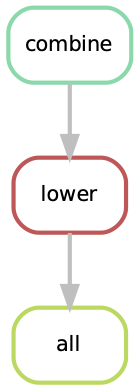

Exercise 1 - Workflow management systems
========================================

Workflow management systems help to structure complex workflows. When a workflow has many steps with many different input and output files in different formats, using some kind of workflow management system can greatly help to increase readability and reusability and thus also reproducibility of your analyses. Once you will be familiar with workflow management, you will never turn back.

In this exercise we will introduce different ways how to automate workflows to increase productivity and reproducibility.

We will be using a very small test dataset to illustrate the principle of what we want to do. The task is this: We want to combine the content of several files into a single file and convert all text in the combined file to lower case. The resulting file should be called ``lower1.txt``. The data for this exercise is in ``additional-data/simple-workflow-example/input1`` in the workshops repository.

First, let us prepare the working environment for today. Run these commands in your home directory:

.. code-block:: bash

   $ mkdir day3
   $ cd day3
   $ git clone https://github.com/reslp/reproducibility-workshop.git

.. admonition:: Exercise

   Navigate to the directory ``additional-data/simple-workflow-example/input1`` and familiarize yourself with the input data file. If possible try to come up with a solution to the proposed task in ``bash``  before reading on.

Using commandline scripting
----------------------------

As you probably figured out, what we want to do can be achieved by using a bash oneliner:

.. code-block:: bash

   $ cat input1/*.txt | tr [:upper:] [:lower:] > lower1.txt

However we will now try to divide this command into individual steps for the sake of this exercise and then make an automated workflow out of it. 

The command above does several things:

1. First, it gets a list of all ``.txt`` files in the ``input1`` directory by using the ``*`` expansion.
2. It shows the content of all the files gather by 1 using ``cat``.
3. It pipes the output of 2 into ``tr`` which converts the streamed content to lower case.
4. Finally the result is piped into a file called ``lower1.txt``

As we have mentioned earlier it is generally a good idea to keep more complex bash operations in shell script files, so they can be reused. How does this command look if we write a shell script.

.. code-block:: bash

   $ cat workflow-scripts/workflow-single.sh
   #!/usr/bin/env bash

   rm -f combined1.txt lower1.txt # remove output from previous runs

   files=$(ls input1/*.txt) # get input files (see 1 above)

   for file in $files # the for loop helps to combine the files (see 2 above)
   do
           cat $file >> combined1.txt
   done
   
   cat combined1.txt | tr [:upper:] [:lower:] > lower1.txt # convert the content of the intermediate file to lower case and pipe to lower.txt (see 3 and 4 above)
   
.. hint::

   What we show here is probably overly complicated for a task like this. The point here is to show how to separate more complex tasks (and in the end complete bioinformatic analyses) into individual tasks. This is something you will have to do when you plan to develop a complex analysis pipleine.

Using a script already increases reproducibility quite a bit. We can take this script, transfer it to a different folder or computer and run it again to generate the final output ``lower1.txt``. If we were to run it on the same input files again we would get the same output.

However, there are several potential pitfalls to keep in mind. One problem with an approach like this is that for complex analyses such a script can quickly become hard to understand. A solution would be to create different scripts (eg. for our test case ``step-1-get-input-files.sh step-2-combine-files.sh step-3-convert-to-lower.sh``). This would help to detect errors and make the code easier to understand because each script only contains code for a single part of the analysis.

Another problem is that if you run a script again (on purpose or by accident) the script will recreate all results regardless of it is necessary or not. Why is this relevant? For one, complex bioinformatic analyses can take a significant amount of time and computational resources. Another aspect is that in many cases it is simply not necessary to recreate results. Only when input files or parameters change you will want to rerun an analysis. However, in large-scale projects with thousands of input and output files it is impossible to keep track which files could have changed. To address these issues (and more which we will see below) workflow management systems have been developed. We will now implement our simple test workflow using different workflow managers.

GNU Make
--------

`GNU Make <https://www.gnu.org/software/make/>`_, make or sometimes ``gmake`` was first introduced in 1976 to build the source code of Unix and it has a long and successful track record in computer science. Typically make is used to compile software from source code. Before ``make`` existed Unix was compiled using custom shell scripts. If you have installed software on Linux or Unix you may be familiar with commands like ``make``, ``make install`` or ``make clean``. As already mentioned ``make`` is usually used to compile software, however it can be used to automate almost any task and even large bioinformatics projects. For example `LongStitch <https://github.com/bcgsc/longstitch>`_) uses make as a workflow manager. We will now create our own small workflow using GNU Make.

How does make work?
~~~~~~~~~~~~~~~~~~~

Make uses the concept of rules. You can think of rules as individual tasks that are executed in a given order. The order is determined by the output of other rules. If we take our example from above, we have already identified the steps (and their order) for the whole workflow to complete successfully. Each rule has a target (the output) and one (or more) dependencies (the input). The rule then contains all instructions (the recipe) to build the output from the input. This is a common concept also in other workflow managers.

Let's have a look at the general structure of a rule in make:

.. code-block:: bash

   targets: prerequisites
        recipe
        …
 
Here is how this could look for our task of converting a file to lower case:

.. code-block:: bash

   lower1.txt: combined1.txt
        cat combined1.txt | tr [:upper:] [:lower:] > lower1.txt

The *target* (output) of this rule is the file ``lower1.txt`` and the *dependency* (input) is ``combined1.txt``. The *recipe* for this rule is the second line. Typically all rules are combined into one or more so-called **Makefiles** which typically are named ``Makefile`` or ``makefile``.

Our simple test workflow in make
~~~~~~~~~~~~~~~~~~~~~~~~~~~~~~~~

How would our simple test workflow look written in make? Let us have a look at the complete ``Makefile`` and then discuss it.

.. code-block:: bash
   
   $ cat workflow-scripts/Makefile-single
   all: lower1.txt

   combined1.txt: input1/*.txt 
           for file in $^; do \
                   cat $$file >> combined1.txt; \
           done
   
   lower1.txt: combined1.txt
           cat combined1.txt | tr [:upper:] [:lower:] > lower1.txt

   clean:
           rm -rf combined1.txt lower1.txt 

In this makefile there are four rules: ``combined1.txt``, ``lower1.txt``, ``all`` and ``clean``. The first two rules have file targets making it clear what they should do: Generate the files ``combined1.txt`` and ``lower1.txt``. Let's look at the ``combined1.txt`` rule in more detail:

.. code-block:: bash
   :linenos:

   combined1.txt: input1/*.txt 
        for file in $^; do \
                cat $$file >> combined1.txt; \
        done
   

In the first line, the target and input is specified, seperated by a colon (:). We use ``input1/*.txt`` to expand to all ``*.txt`` files in the ``input1`` directory. The recipe in the rule is a simple bash ``for`` loop. What is new here is the variable ``$^`` which is make specific (look `here <https://www.gnu.org/software/make/manual/html_node/Automatic-Variables.html>`_ for additional details). It holds a list of all input files which the for loop should iterate over. Also multi-line statements as given here (the recipe consits of lines 2-4) have to be separated by a backslash ``\``. This is a peculiarity of make, which requires recipies to only contain one line of code. With the backslash make knows that the command continues in the next line. The third line contains the actual ``cat`` command. In bash we would write ``cat $file`` instead of ``cat $$file``. Since make also has variables which start with ``$`` we need to let make know that this is a bash variable which is why we need the extra ``$``.

.. tip::

   If you are familiar with ``bash`` scripting, the escaping rules and formatting of multiline commands may look weird. Keep in mind that although it looks similar ``make`` is not ``bash`` and the syntax is different. Here are a few links where escaping rules are explained in more detail:

   - `Escaping $ in Makefiles <https://til.hashrocket.com/posts/k3kjqxtppx-escape-dollar-sign-on-makefiles>`_
   - `GNU Make Escaping: A Walk on the Wild Side <https://www.cmcrossroads.com/article/gnu-make-escaping-walk-wild-side>`_
   - `Stackoverflow answer to escaping in make <https://stackoverflow.com/a/7860705>`_

Now that we know the basic structure of make rules, the rule to create ``lower.txt`` should be self explanatory.

Special make rules
~~~~~~~~~~~~~~~~~~

The rules ``all`` and ``clean`` are new and they don't exist in the shellscript version of our pipeline. It is often quite useful to have these special rules in your makefile. If you have already build some software with make you will know that ``clean`` removes (intermediate) results and ``all`` is the rule to recreate all output. It is not necessary to have these special rules, but there are many cases where they become useful.

Execute a make workflow
~~~~~~~~~~~~~~~~~~~~~~~

Executing a make workflow is simple. You have to navigate to the directory where your makefile is located and execute ``make``.

.. code-block:: bash

   $ cp workflow-scripts/Makefile-single Makefile
   $ make
   for file in input1/A.txt input1/B.txt input1/C.txt input1/D.txt; do \
   	cat $file >> combined1.txt; \
   done
   cat combined1.txt | tr [:upper:] [:lower:] > lower1.txt
   $

Here are some other examples:

.. code-block:: bash

   $ make combined1.txt # this will only create the combined file
   make: 'combined1.txt' is up to date.
   $ make clean # this will remove all files:
   rm -rf combined1.txt lower1.txt
   $ make all # equivalent to make (in this case)

This is it. Given that the makefile is correct and it finds all the files, this is all you have to do to execute the workflow and you should find the final output file ``lower.txt`` in the same directory.

Behind the scenes, ``make`` searches for a Makefile in the present directory and executes the first rule it finds in the file. Since the first rule is the *all* rule, which requires the ``lower.txt`` file, make will continue to search for a rule called ``lower.txt``. It sees that the lower.txt rule requires the ``combined.txt`` file which is created in the according rule. The order of rule executon thus is: combined.txt -> lower.txt -> all.

.. admonition:: Exercise

   Play around with this workflow. Run make again and see what happens. Try to break the workflow by changing the Makefile. Which error messages do you get? Can you change the workflow so that it only usestwo files instead of four? Can you add another rule (eg. to create another file in upper case)?

Parallelization with make
~~~~~~~~~~~~~~~~~~~~~~~~~

Our workflow has one major flaw. Currently our workflow works only with a single input. How can we extend this to multiple inputs and run rules in parallel? This is something we typically want to do in large scale analyses to use computational resources optimally and reduce runtimes as much as possible. Consider the following Makefile which is extended for multiple inputs:

.. code-block:: bash
   :linenos:

   $ cat workflow-scripts/Makefile-multi
   all: lower1.txt lower2.txt
      
   combined%.txt: input%/*.txt
           for file in $^; do \
                   cat $$file >> $@; \
           done
   
   lower%.txt: combined%.txt
           cat $^ | tr [:upper:] [:lower:] > $@
   
   clean:
           rm -rf combined*.txt lower*.txt

As you can see we are now using a second input directory. The logic here is that we are using the same naming scheme for input directories so make can find them. In this case: ``input1`` and ``input2``. Make then uses a concept called *wildcards* to match the names of input and output files. In ``make`` we can specify a placeholder for whichever values a wildcard can have in file paths with ``%``. You can read the `wildcards chapter <https://www.gnu.org/software/make/manual/make.html#Wildcards>`_ in make's documentation for more details on wildcards and how to use them. There are different types of wildcards which serve different purposes (eg. ``*`` is also a wildcard). 

.. admonition:: Exercise

   Think about how many wildcards we have and which values they can take. Let's discuss this.

There are a few additional changes to the Makefile compared to the version written for only a single input. For example we needed to use the special variable ``$@`` in line 9 above which refers to the target (output) of the rule as well as the ``$^`` which we have already seen earlier. This is simply because we don't know the value of a wildcard before the rule gets executed. Make will automatically fill in the correct values as we execute the workflow. Additionally, the clean rule has to now delete additional files.

We can now execute the workflow in parallel:

.. code-block:: bash

   $ make clean
   $ cp workflow-scripts/Makefile-multi Makefile
   $ make all -j 2 #this will run two jobs in parallel

.. admonition:: Exercise

   Your task now is to apply this logic and extend your workflow to use parallelization. Make sure that you have at least three input directories and then run the workflow in parallel.

Many more possibilities
~~~~~~~~~~~~~~~~~~~~~~~

The example above only barely scratches the surface of what you can do with make. There are many extensions, for example also a variant called `biomake <https://github.com/evoldoers/biomake>`_ which is compatible with most of GNU make's features but extends GNU make by adding support for HPC cluster job submission systems and multiple wildcards per target. Make has a great documentation and a very long and successful track record in many large scale projects. For reproducibility make can be a very handy tool. It will make your workflows more transparent and much better structured with almost unlimited reusability. If this has spawned your interest in make here are some links with more information:

- `GNU Make documentation <https://www.gnu.org/software/make/manual/make.html>`_
- `Make tutorial <http://www.bioinformaticszen.com/post/makefiles/>`_
- `Learning Make <https://davetang.org/muse/2015/05/31/learning-about-makefiles/>`_ (with an example on how to incorporate R)

We will soon look at workflow management systems tailored more specifically for bioinformatics however everything we will show you can also be done with make (although sometimes with a bit more effort).

.. hint::

   The concepts of *rules* and *wildcards* which we introduced now with make are also very important in other workflow managers. It is important that you familiarize with them well.

Snakemake
---------

`Snakemake <https://snakemake.readthedocs.io/en/stable/>`_ is another commonly used workflow management system with lots of features. Many bioinformatics pipelines use snakemake such as our own `phylociraptor <https://github.com/reslp/phylociraptor>`_. Snakemake also heavily uses the concept of rules and wildcards and has many features allowing it to operate on HPC clusters, or other cloud computing infrastructures such as AWS, Google cloud and a lot more. Snakemake is developed rapidly and it can happen that snakemake pipelines written in older versions of snakemake stop working in newer versions. It is therefore important to be version specific when using it.

We have installed snakemake in a conda environment for you already. You can activate it like so:

.. code-block:: bash
   
   $ conda activate serpentesmake
   (serpentesmake) $ snakemake -v
   5.9.1

The corresponding yaml file of the environment is in the repository in ``additional-data/conda-environments/serpentesmake.yml``. Here is the content of this file:

.. code-block:: bash

   name: serpentesmake
   channels:
     - conda-forge
     - bioconda
     - defaults
   dependencies:
     - snakemake==5.9.1
   prefix: /home/ubuntu/conda/miniconda3/envs/serpentesmake

The test workflow in snakemake
~~~~~~~~~~~~~~~~~~~~~~~~~~~~~~

Snakemake is written in python and also its syntax is basically a python dialect. In snakemake you can also use pure python in many cases. This makes it easier to get started if you are already familier with python. Let us look at our example workflow. You will surely recognize the similarity with python.

.. code-block:: bash
   :linenos:

   (serpentesmake) $ cat workflow-scripts/Snakefile-single
   rule combine:
           input: "input1/A.txt", "input1/B.txt", "input1/C.txt"
           output: "combined1.txt"
           shell:
                   """
                   cat {input} >> {output}
                   """
   
   rule lower:
           input: rules.combine.output
           output: "lower1.txt"
           shell:
                   """
                   cat {input} | tr [:upper:] [:lower:] > {output}
                   """
   rule all:
           input: "lower1.txt"

In snakemake rules are specified by the keyword ``rule`` followed by the rule name. Snakemake follows the indentantion style of python. You are not allowed to mix different styles (spaces and tabs) to indent line. Rules in snakemake have different directives such as ``input:``, ``output:`` and ``shell:``.  ``input:`` and ``output:`` require one or more files which will be used by the rule as input and output. The ``shell`` directive is where the code we would like to execute is located. We can also access our input and output inside the ``shell`` part of the rule with curly brackets ``{}``. In snakemake rules can be connected by the output of other rules (similar to ``GNU make``) directly through the rules object: ``rules.combine.output``. In practice this is a nice feature because the connection between the rules will stay intact even if you change the name of the output file in the combine rule.

Similar to GNU make we can have an ``all`` rule. As you can see, the ``all`` rules does not have an output. It only requires the ``lower1.txt`` file as ``input``.

There are many additional directives in snakemake to modify how rules work. For example you can specify a conda yml file with ``conda:``. Snakemake will then create and activate a conda environment for you and run the code in the shell part inside this environment. Similarly with ``container:`` cou can specify a singularity container which is then used as runtime environment for you code. With ``params:`` you can specify additional parameters eg. values read from a YAML file. 

Executing snakemake workflows
~~~~~~~~~~~~~~~~~~~~~~~~~~~~~

Similar to GNU make, snakemake expects a file containing all the rules to be present where you run your workflow. This file is called ``Snakefile``. If the ``Snakefile`` exists, you can run the workflow like so:

.. code-block:: bash

   (serpentesmake) $ rm *.txt # make sure all output files from previous runs are removed first
   (serpentesmake) $ cp workflow-scripts/Snakefile-single Snakefile #copy Snakefile
   (serpentesmake) $ snakemake --cores 1 all
   Building DAG of jobs...
   Using shell: /bin/bash
   Provided cores: 1 (use --cores to define parallelism)
   Rules claiming more threads will be scaled down.
   Job counts:
   	count	jobs
   	1	all
   	1	combine
   	1	lower
   	3
   
   [Wed Jul 13 09:43:15 2022]
   rule combine:
       input: input1/A.txt, input1/B.txt, input1/C.txt
       output: combined1.txt
       jobid: 2
   
   [Wed Jul 13 09:43:15 2022]
   Finished job 2.
   1 of 3 steps (33%) done
   
   [Wed Jul 13 09:43:15 2022]
   rule lower:
       input: combined1.txt
       output: lower1.txt
       jobid: 1
   
   [Wed Jul 13 09:43:15 2022]
   Finished job 1.
   2 of 3 steps (67%) done
   
   [Wed Jul 13 09:43:15 2022]
   localrule all:
       input: lower1.txt
       jobid: 0
   
   [Wed Jul 13 09:43:15 2022]
   Finished job 0.
   3 of 3 steps (100%) done
   Complete log: /home/user22/day3/reproducibility-workshop/additional-data/simple-workflow-example/.snakemake/log/2022-07-13T094315.367603.snakemake.log
   $

Snakemake has many additional parameters which you can use to change its behavior. It can become overwhelming quickly If you look at ``snakemake --help`` and specif snakemake commands can quickly become very long! Here are some additional parameters we think are important to get started with snakemake: 

- ``-p`` prints also the code inside the shell directives on screen.
- ``-n, --dry-run`` performs a *dry run*. This lists all the rules to be executed without actually running them
- ``--until myrule`` run workflow until rule myrule.
- ``-c, --cores`` maximum number of cores to be used in parallel.
- ``-f, --force`` force a rerun of the selected target rule.
- ``-F, --forceall`` force rerun of workflow.
- ``--use-conda, --use-singularity, --use-envmodules`` if you want to use containers, conda or environment modules.

The snakemake rulegraph
~~~~~~~~~~~~~~~~~~~~~~~

A rulegraph shows the relationships between different rules and how they are connected. This rulegraph for our test workflow is quite simple and linear. Rulegraphs of complext pipelines can look very different as rules can themselfes depend and be the dependency of multiple other rules.

From this graph we assume that our workflow works as we indended. In more complex situations, rulegraphs can be a nice way to find dependency problems and  it is a great way to show what the workflow does. 

.. admonition:: Exercise

   Create a snakefile and run the workflow. Figure out how to create a rule-graph of the workflow.

Generalizing the workflow
~~~~~~~~~~~~~~~~~~~~~~~

Similar to Nextflow and make we can make this workflow more general and extend it to allow multiple input. We will be using the concept of wildcards again, which we introduced in the section on ``GNU make``. We have learned that wildcards are placeholders and can take any value. Similar to make snakemake operates on files, so typically wildcards take a part of a file or directory name or path as values. The wildcard system of snakemake is much more flexible than that of ``GNU make``. However as mentioned flavors of ``make`` exist with a more comprehensive wildcard system.

First, let us see how our workflow looks when we extend it to use wildcards. The input directories are again called ``input1`` and ``input2``.

.. code-block:: bash
   :linenos:

   (serpentesmake) $ cat workflow-scripts/Snakefile-multi
   mynumbers = [1, 2]
   
   rule combine:
           input: "input{number}/"
           output: "combined{number}.txt"
           shell:
                   """
                   cat {input}/*.txt >> {output}
                   """
   
   rule lower:
           input: rules.combine.output
           output: "lower{number}.txt"
           shell:
                   """
                   cat {input} | tr [:upper:] [:lower:] > {output}
                   """
   rule all:
           input: expand("lower{number}.txt", number=mynumbers)

What has changed? The first line now contains a python list with all the values our wildcard can have. In this case ``1`` and ``2``. The inputs and output of the rules has changed as well: We need to somehow let snakemake now where the values of the wildcard need to be filled in. In this case the wildcard value is a part of the input directory name or the name of the output files. The name of the wildcard is ``{number}``. This uses the same *placeholder* syntax with ``{}`` as we have seen earlier.

.. hint::

   Wildcards can take any name. Instead of *number* we could for example also call it *x* or *myawesomewildcard*. However the name needs to be the same in all rules (except for the all rule which uses ``expand``; see below) so that snakemake is able to propagate the value of the wildcard from rule to rule. It is generally a good idea to have informative wildcard names as this will make it easier to debug problems.

Now, how does snakemake know which files it should generate and which rules it needs to run? This information comes from the ``all`` rule. The input has changed to ``input: expand("lower{number}.txt", number=mynumbers)``. ``expand`` will create a list of files in which it substitutes the wildcard ``{number}`` with all the values from the list given in the first line of the file called ``mynumbers``. This is equivalent as if we would specify the input as ``input: "lower1.txt", "lower2.txt"``.

Let's make a dry run of the workflow: 

.. code-block:: bash
   
   (serpentesmake) $ rm -rf *.txt # remove output from previous runs
   (serpentesmake) $ cp workflow-scripts/Snakefile-multi Snakefile
   (serpentesmake) $ snakemake all -n
   Building DAG of jobs...
   Job counts:
   	count	jobs
   	1	all
   	2	combine
   	2	lower
   	5
   
   [Wed Jul 13 09:46:58 2022]
   rule combine:
       input: input1/
       output: combined1.txt
       jobid: 3
       wildcards: number=1
   
   
   [Wed Jul 13 09:46:58 2022]
   rule combine:
       input: input2/
       output: combined2.txt
       jobid: 4
       wildcards: number=2
   
   
   [Wed Jul 13 09:46:58 2022]
   rule lower:
       input: combined2.txt
       output: lower2.txt
       jobid: 2
       wildcards: number=2
   
   
   [Wed Jul 13 09:46:58 2022]
   rule lower:
       input: combined1.txt
       output: lower1.txt
       jobid: 1
       wildcards: number=1
   
   
   [Wed Jul 13 09:46:58 2022]
   localrule all:
       input: lower1.txt, lower2.txt
       jobid: 0
   
   Job counts:
   	count	jobs
   	1	all
   	2	combine
   	2	lower
   	5
   This was a dry-run (flag -n). The order of jobs does not reflect the order of execution.

As you can see each rule will now be executed twice execpt the all rule.

 
.. admonition:: Exercise

   Add additional values for the wildcard and make another dry run of the workflow. What happens?

Parallelization with snakemake
~~~~~~~~~~~~~~~~~~~~~~~~~~~~~~

Snakemake is great at performing different tasks in parallel. Parallelization can be specified independently for each rule with the ``threads`` directive. For example this would tell snakemake to run the ``lower`` rule using two threads:

.. code-block:: bash
   :emphasize-lines: 4

   rule lower:
           input: rules.combine.output
           output: "lower{number}.txt"
           threads: 2
           shell:
                   """
                   cat {input} | tr [:upper:] [:lower:] > {output}
                   """

This does not automatically mean that the rule runs faster. It just means that snakemake tries to allocate two threads when it executes the rule. Additionally the number of threads needs to be specified by snakemake's ``-c`` flag. By default each rule uses only one thread. If you call ``snakemake -c 1`` the execution of rules will be strictly serial (similar to calling ``make`` without additional flags). This global setting also overrides settings of individual rules. If you would like to use parallelization with snakemake you have to specify at least two threads: ``snakemake -c 2``. In our example, the ``lower`` rule uses two threads and the rest of the rules use only a single thread, which means that snakemake would run the two ``combine`` rules simulaneously (because the use only a single thread) and run each ``lower`` rule one after the other (because each of them uses two threads). Snakemake is smart to fill up the available threads as much as possible. Using threads and parallelization because especially important with complex workflows.

 
Nextflow
--------

Another, slightly different Workflow manager is `Nextflow <https://nextflow.io/>`_. It follows a slightly different paradigm than make and Snakemake and it uses a different terminology. Rules are called *processes* and different processes communicate through so-called *channels*. A *channel* is similar to a pipe in the Linuxshell, but there is a bit more to it. If you are interested, you can look `here <https://www.nextflow.io/docs/latest/channel.html>`_ to learn more. One big difference to make and snakemake is that in Nextflow input and output of different *processes* do not necessarily have to be files. Rather, values can be passed between processes without writing intermediate results to files. This can be very nice to reduce the number of files but it can also make it more complicated if you are not familiar with piping. To make this nextflow example easier to compare with the same implementation in make and snakemake, we will create outputfiles for all intermediate steps. Nextflow is based on Java mainly using the `Apache Groovy <https://en.wikipedia.org/wiki/Apache_Groovy>`_ super-set. We are no experts with Nextflow, however we wanted to show you how it looks in case it is a system that you would like to pursue further. Here is how our workflow looks like:

.. code-block:: bash
   :linenos:

   $ cat workflow-scripts/workflow.nf
   params.indir = "$baseDir/input1/"
   
   process combine {
       input: path indir
       output: file "combined1.txt"
       shell:
           """
               for file in \$(ls $indir/*.txt); do
                   cat \$file >> combined1.txt
               done
           """
   }
   
   process lower {
       input: file "combined1.txt"
       output: file "lower1.txt"
       shell:
          """
             cat combined1.txt | tr [:upper:] [:lower:] > lower1.txt
          """
   }
   
   workflow {
       combine(params.indir) | lower | view
   }
 
As you can see the syntax is a bit different to what we have seen so far. Let's disect it a bit. Individual processes are declared with the keyword ``process`` followed by a name. The whole code for each process is wrapped in curly brackets ``{}``. Each process requires one or more input and can produce one or more outputs. Also mandatory is a part that contains the code which should be executed (in this case it is called ``shell:``). Inputs and outputs get their values by connecting to *channels*. Channels can contain different kinds of data and Nextflow distinguishes between them. In this case we are using the ``path`` type for the input of the ``combine`` process and ``file`` for the ``lower`` process.

The bash code inside the ``shell`` parts of the processes is almost the same to what we have seen. The only difference is that we need to escape values of bash variables with ``\$variable`` because Nextflow also uses the ``$`` sign to access its own variables.

Differently to other managers we also have a directive called ``workflow``. You can think of this as the `all` rule in make or Snakemake. The difference to these rules is that in the Nextflow equivalent we have to specify how the workflow should be executed. As you can see we can use pipes ``|`` to connect different processes. This is used to connect the output of one channel with the input of the next one. 

.. admonition:: Exercise

   Think about how this differs from how Snakemake and make work. What is the fundamental difference? Let's discuss.

Let us disect the line: ``combine(params.indir) | lower | view``. The first part of our workflow is to combine all the files into one. We have to let the process know where the input is, so we pass the input to the processes (similar to a function call in almost any programming language). The files are processed and the output is piped into the next process ``lower`` which converts it to lower case and saves it to ``lower.txt``. Lastly we pipe the output of the lower ``process`` into the ``view`` command which prints the path of the output file on screen. We have to do this because Nextflow runs the whole workflow inside a special temporary directory. This behavior can be changed, however we wanted to show you the defaults first.

Execute Nextflow
~~~~~~~~~~~~~~~~

Let us execute the workflow now. We will be running nextflow from a docker container:

.. code-block:: bash

   $ cp workflow-scripts/workflow.nf .
   $ docker run --rm -it -v $(pwd):/data -w /data nextflow/nextflow:22.04.4 nextflow workflow.nf
   N E X T F L O W  ~  version 22.04.4
   Launching `lower.nf` [hungry_borg] DSL2 - revision: 369f0fca2c
   WARN: Process with name 'combine' overrides a built-in operator with the same name
   executor >  local (2)
   [01/017747] process > combine [100%] 1 of 1 ✔
   [08/692b7f] process > lower   [100%] 1 of 1 ✔
   /data/work/08/692b7fdd0beaa7730b6e6d6f4a3d9e/lower.txt

Nextflow prints some information about what it does on your screen. You can see the two processes and that the have finished sucessfully as indicated by the ``✔``. The last line gives the path to the output file.

Some additional features
~~~~~~~~~~~~~~~~~~~~~~~~

It is clear that our example workflow only barely scratches the surface of what Nextflow can do, and using a Nextflow workflow for this simple task is probably a bit of an overkill. However several people of spent a lot of time designing Nextflow workflows and you can download premade workflows from a community supported database called `nf-core <https://nf-co.re/>`_. Nextflow can interact with different cloud infrastructures like AWS, Google Cloud or Kubernetes Clusters. If you are interested in Nextflow and want to learn more, here are a few links that can get you started:

- `Learning Nextflow in 2022 <https://www.nextflow.io/blog/2022/learn-nextflow-in-2022.html>`_
- `Nextflow documentation <https://www.nextflow.io/docs/latest/index.html>`_
- `List of nf-core pipelines <https://nf-co.re/pipelines>`_ 

A superficial speed comparison
------------------------------

Now that we have written the same simple workflow we can compare how fast they execute to see if we can find a difference between them. We have prepared a small script which helps us do that. The script is in ``additional-data/time-workflows.sh``. You will have to copy it over to the directory where you have created the different workflows. Here is how it looks:

.. hint::

   You have to make sure that the snakemake conda environment is active!

.. code-block:: bash
   :linenos   :linenos::

   (serpentesmake) $ cat time-workflows.sh
   #!/usr/bin/env bash
   
   conda activate sm7.8.5
   # function modified from https://stackoverflow.com/a/54920339
   avg_time() {	
       #
       # usage: avg_time n command ...
       #
       n=$1; shift
       (($# > 0)) || return                   # bail if no command given
       for ((i = 0; i < n; i++)); do
           { time -p "$@" &>/dev/null; } 2>&1 # ignore the output of the command
                                              # but collect time's output in stdout
   # the sed is used in case the decimal seperator is , instead of . due to locale
       done | tee | sed 's/,/\./' | awk '           
           /real/ { real = real + $2; }
           /user/ { user = user + $2; }
           /sys/  { sys  = sys  + $2; }
           END    {
                    printf("real %f sec\n", real);
                    printf("user %f sec\n", user);
                    printf("sys %f sec\n",  sys)
                  }'
   }
   
   ntimes=100
   echo "$ntimes GNU Make runs take:"
   avg_time $ntimes make all -B
   echo
   echo "$ntimes Snakemake runs take:"
   avg_time $ntimes snakemake --forceall all
   echo
   echo "$ntimes Nextflow runs take:"
   avg_time $ntimes nextflow lower.nf

The script will use the ``time`` command to measure how long a command runs. To get a better comparison (one individual run may finish very quickly) we will run each workflow 100 times.

.. admonition:: Exercise

   Your task now is to run this script to get an estimate of how long each workflow manager takes. Make sure that the conda activate command in the script points to the correct conda environment. What do you find?

Workflow managers wrap-up
-------------------------

As you saw there are different options for creating bioinformatic workflows. It is not so important which of the systems we introduced (or any other workflow maanager) we choose, but we hope we could convince you that they can be really useful. Once you familiarize yourself with either system, it will greatly improve reproducibility, transparency and portability of your work. It will also change the way you think about your analyses. It becomes easier to divide longer workflows into individual tasks. Your workflows can then be stitched together easily and parts of one workflow can be used in another. Extending workflows is also going to be much more straightforward. Here is a list of pros and cons of all three Workflow managers introduced in this exercise. Mind you this is our subjective take on this, so we are happy if you disagree with our assessment.

GNU Make
~~~~~~~~

**pros**

- Syntax is close to bash
- Very little overhead
- Standard tool on Linux
- very extensively tested
- extensive documentation

**cons**

- lower readability of code compared to other workflow managers
- not specifically made with bioinformatics in mind
- interaction with HPC cluster only through ``biomake`` add-on

Snakemake
~~~~~~~~~

**pros**

- Lot's of learning resources
- great interop with python
- easy to understand how rules are linked
- very actively developed to accomodate emerging technologies
- easy to learn
- many available workflows

**cons**

- Different versions not 100% compatible
- larger overhead
- Python makes it slower
- hard to master

Nextflow
~~~~~~~~
 
**pros**

- rock solid integration with different cloud computing plattforms
- not dependent on files to connect workflow parts
- many workflows available (eg. at nf-core)

**cons**

- More complex syntax
- A lot of the available online resources are not up to date with currently used syntax (DSL1 vs. DSL2)
- hard to master
- less learning resources available

